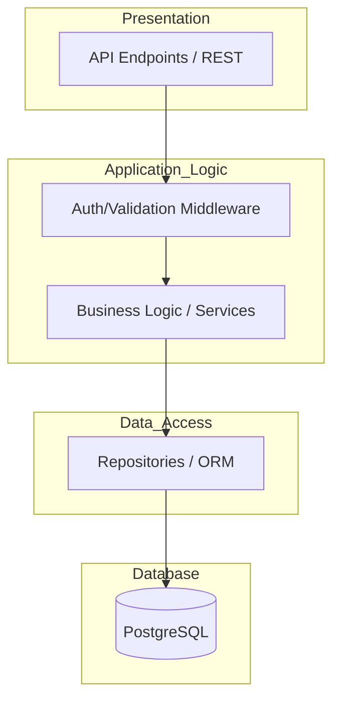

# Architecture Diagram

```mermaid
graph TD
    subgraph Presentation
        API[API Endpoints / REST]
    end

    subgraph Application_Logic
        Middleware[Auth/Validation Middleware]
        Services[Business Logic / Services]
    end

    subgraph Data_Access
        Repositories[Repositories / ORM]
    end

    subgraph Database
        DB[(PostgreSQL)]
    end

    API --> Middleware
    Middleware --> Services
    Services --> Repositories
    Repositories --> DB
```
