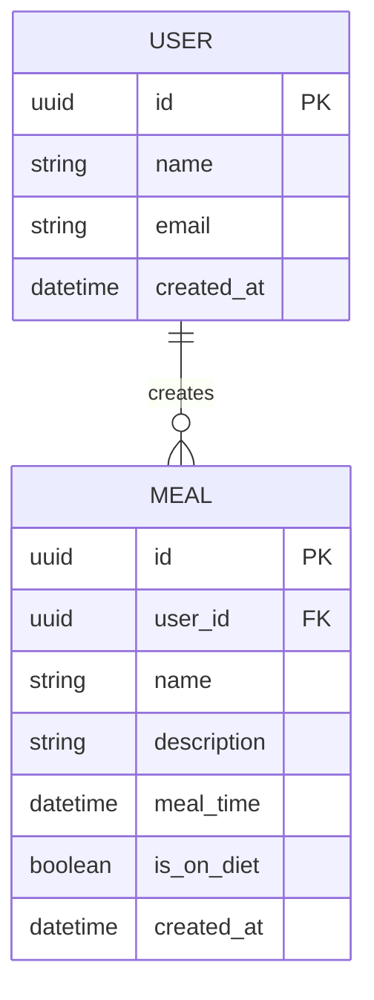

# ERD - Daily Diet

```mermaid
erDiagram
    USER ||--o{ MEAL : "creates"
    
    USER {
        uuid id PK
        string name
        string email
        datetime created_at
    }
    
    MEAL {
        uuid id PK
        uuid user_id FK
        string name
        string description
        datetime meal_time
        boolean is_on_diet
        datetime created_at
    }
```
