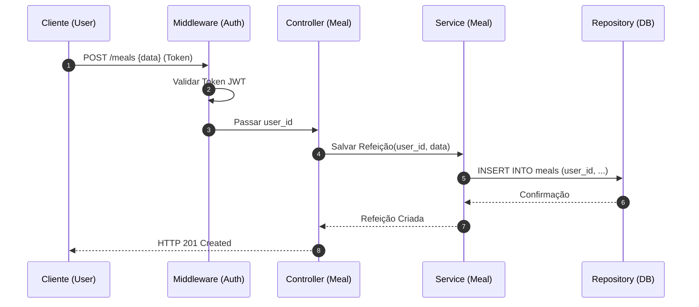

# Sequence Diagram - Create Meal

```mermaid
sequenceDiagram
    autonumber
    participant U as Cliente (User)
    participant A as Middleware (Auth)
    participant C as Controller (Meal)
    participant S as Service (Meal)
    participant D as Repository (DB)

    U->>A: POST /meals {data} (Token)
    A->>A: Validar Token JWT
    A->>C: Passar user_id
    
    C->>S: Salvar Refeição(user_id, data)
    S->>D: INSERT INTO meals (user_id, ...)
    D-->>S: Confirmação
    S-->>C: Refeição Criada
    C-->>U: HTTP 201 Created
```
